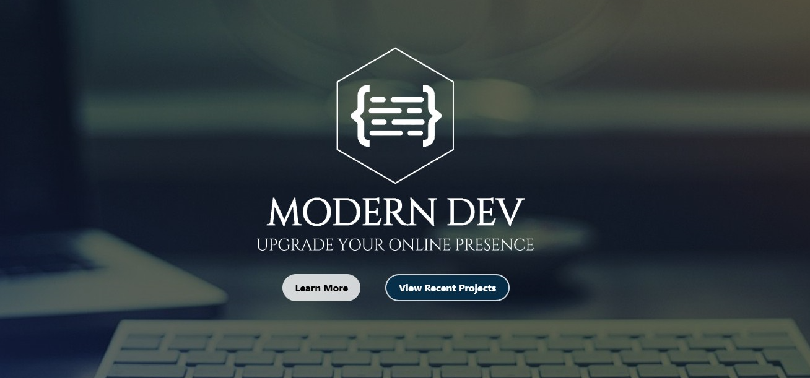
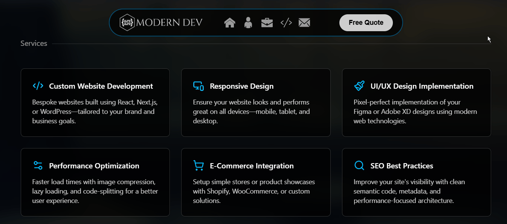
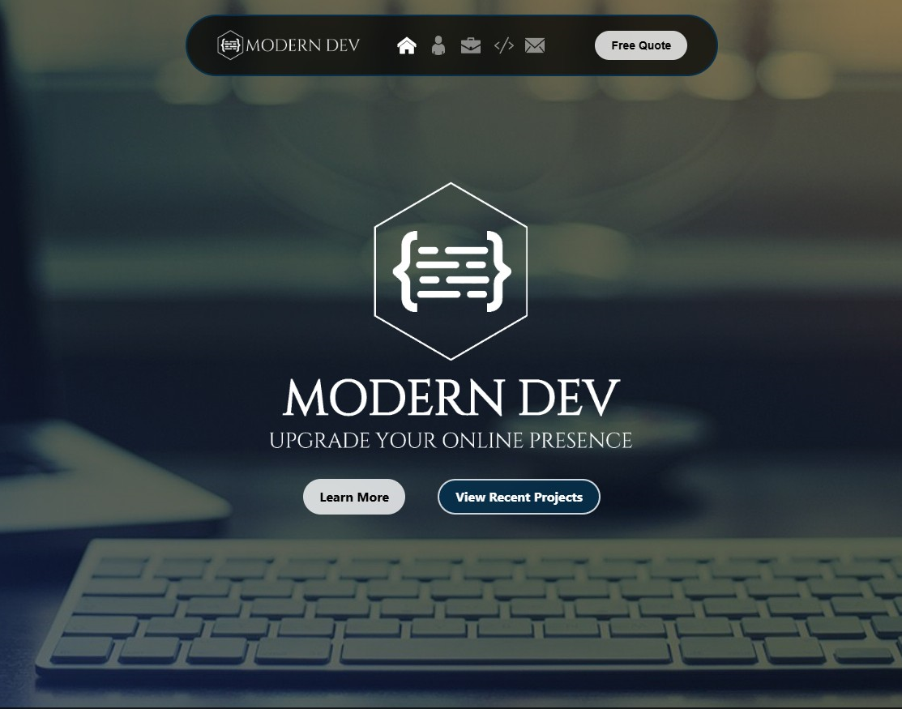
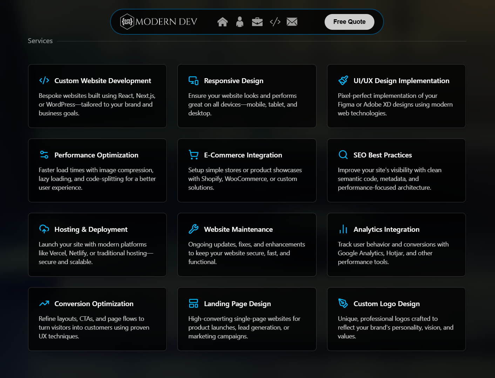
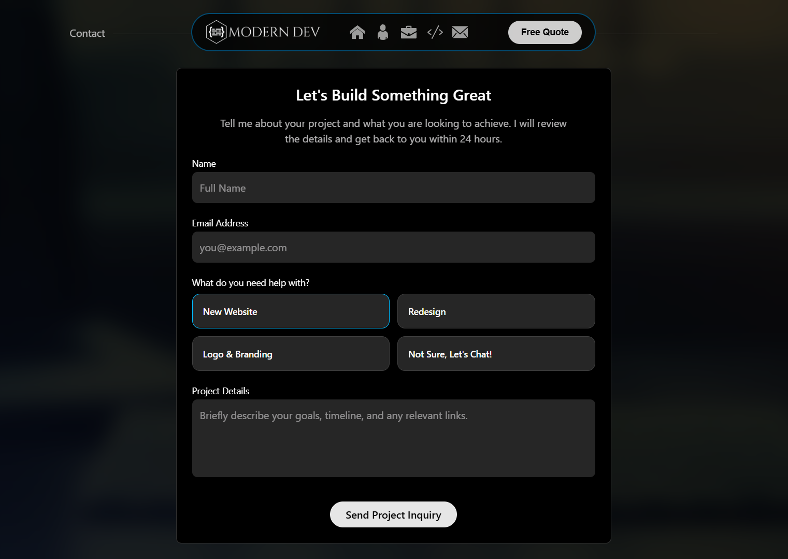

# Modern Dev

A custom-built developer portfolio and business website engineered with Next.js, React, and Tailwind CSS. Designed with a focus on performance, clean UI, and a conversion-driven user experience.

**Live Site:** https://www.moderndev.pro

---

## Overview

Modern Dev is a personal project built to attract and convert small to mid-sized businesses looking to improve their online presence. The goal was to create a site that not only looks polished, but also demonstrates strong frontend engineering, thoughtful UX decisions, and attention to detail.

---

## Preview

---

## Screenshots

| Hero | Services |
|------|----------|
|  |  |

| Contact |
|---------|
|  |

---

## Tech Stack

- **Framework:** Next.js  
- **Frontend:** React + TypeScript  
- **Styling:** Tailwind CSS  
- **Animation:** Framer Motion  
- **Deployment:** Vercel  

---

## Key Features

- Fully responsive layout optimized across all breakpoints  
- Custom-designed UI aligned with a modern, developer-focused aesthetic  
- Smooth, intentional animations using Framer Motion  
- Interactive card-based UI with hover states and transitions  
- Conversion-focused contact form with simplified service selection  
- SEO-friendly structure with semantic HTML  
- Performance-conscious asset handling and layout structure  
- Clean visual hierarchy for improved readability and usability  

---

## Notable Engineering Decisions

### 1. Geometry-Based Icon Scaling

Scaling hexagonal social icons alongside their background introduced alignment issues across breakpoints.  
Instead of relying on manual adjustments, the solution was to **tie the icon dimensions directly to the geometry of the background container**, creating a consistent scaling relationship.

This eliminated drift and ensured visual alignment remained stable at every screen size.

---

### 2. Custom Breakpoint Debugging Tool

Debugging responsive issues across multiple breakpoints became inefficient when relying solely on browser tools.

To solve this, a **custom debugging component** was built to display:
- Current screen width  
- Active Tailwind breakpoint (xs → 3xl)  

This made it significantly faster to:
- Identify exactly where layout issues occurred  
- Apply precise fixes without guesswork  

---

### 3. Improved Form UX

The service selection was redesigned from standard radio inputs into **card-style selectable options**, resulting in:
- Lower cognitive load  
- Clearer visual hierarchy  
- A more engaging interaction pattern  

---

## Design & UX

- Modern developer aesthetic with a dark UI  
- Clean, minimal layout with a slightly premium feel  
- Mobile-first design approach  
- Subtle micro-interactions to enhance usability without distraction  

---

## Form Handling

The contact form is powered by **Resend**, enabling reliable email delivery with a clean and minimal frontend experience.

---

## Performance

**Lighthouse Scores:**

- Performance: 83  
- Accessibility: 83  
- Best Practices: 100  
- SEO: 91  

---

## Future Improvements

- Add a blog to support content marketing and SEO  
- Expand case studies to showcase real client work  

---

## About

This project reflects my approach to frontend development: combining clean design, strong UX fundamentals, and modern tooling to create fast, effective websites that solve real business problems.
